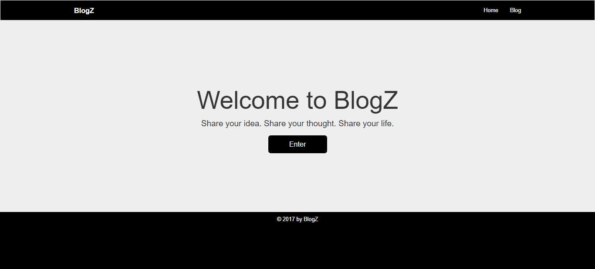
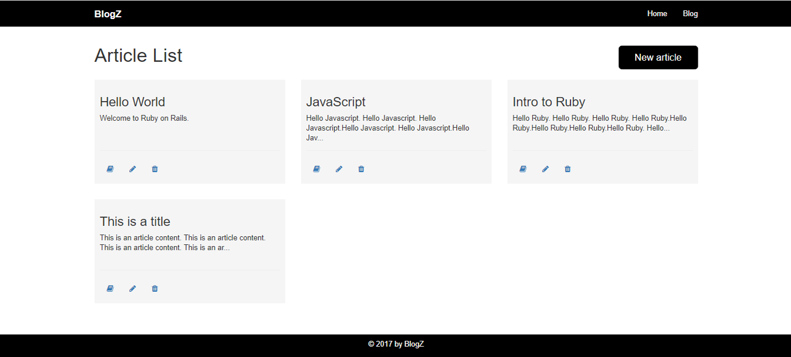
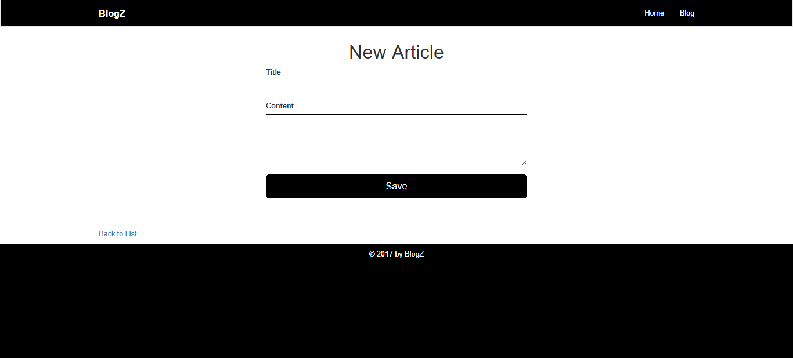
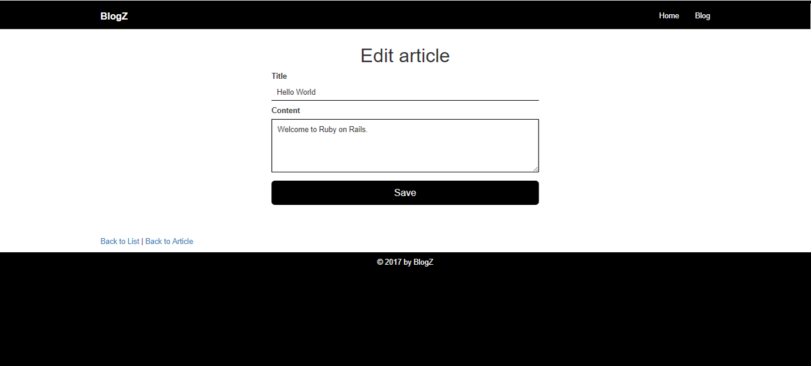
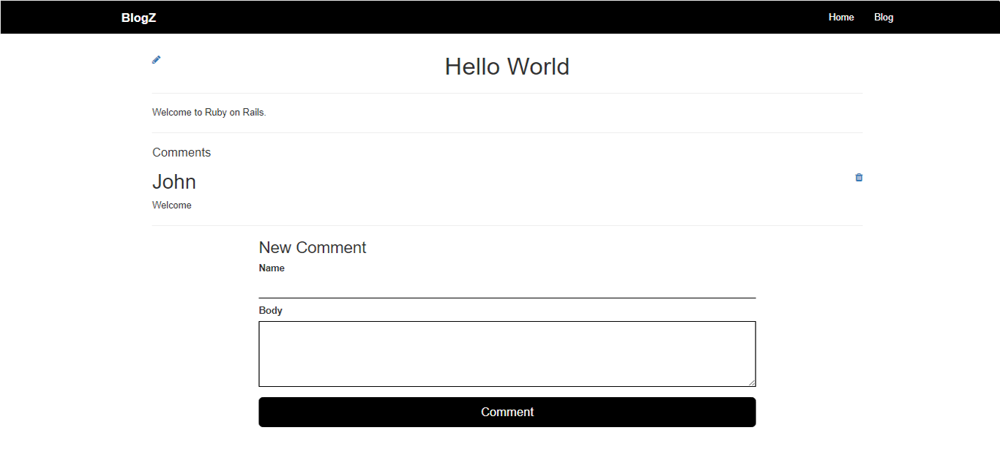

# BlogZ

BlogZ is a simple blog application. This actually a continuation of the [Blog practice](https://github.com/siegren/VIVIXX-Blog) that I have created. I added a very simple design. It's not finished yet but I'm going to continue updating this.

## Technologies Used
- Ruby on Rails
- HTML
- CSS
- Javascript/Jquery
- Font Awesome

## Features
##### 1. You can add, view, and delete articles. In adding new article, you need to put the title and content of the article. It is required to put the title and the number of characters should be minimum of five (5).
##### 2. You can add, view, and delete comment for each article. You will provide your name if you're going to comment to a certain article.
##### 3. There is authentication form where in you will enter a username and password if you want to delete an article or a comment.

## Screenshots

### Main Page

### Listing Article

### New Article

### Edit Article

### Show Artcile and Comments

